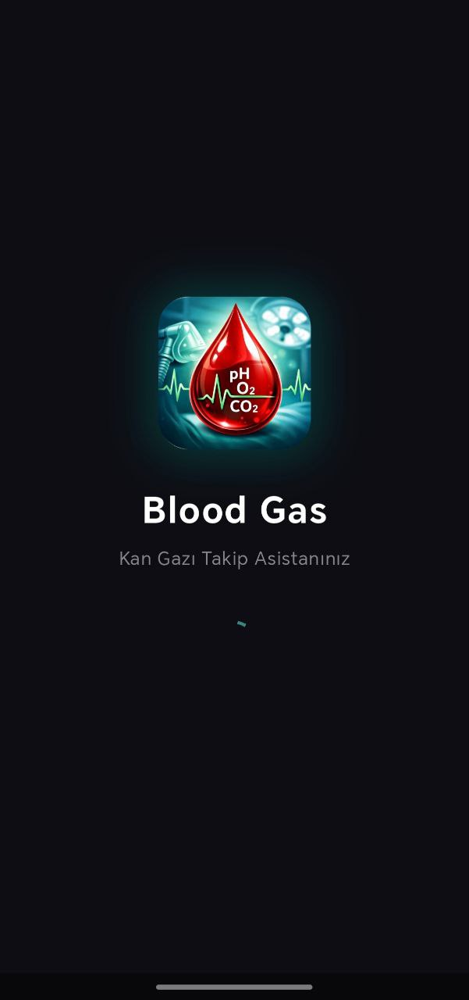
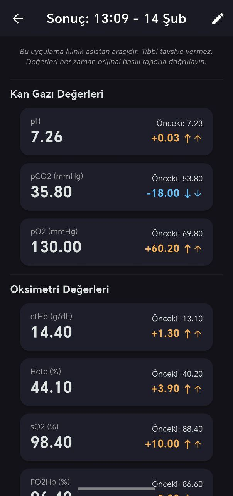
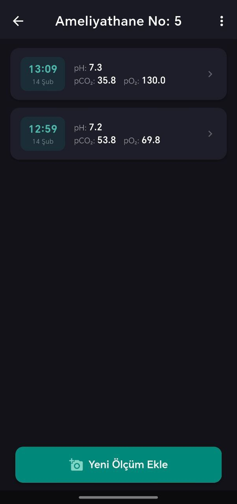
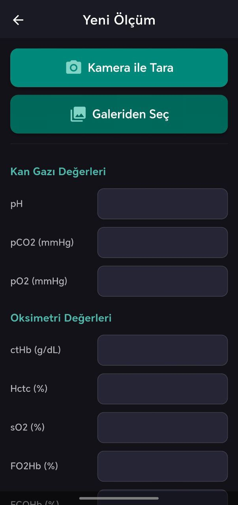

# Blood Gas 🩸


Anestezi doktorları için tasarlanmış, ameliyat sırasında arteriyel kan gazı (AKG) değerlerini hızla dijitalleştirip takip etmeyi sağlayan mobil uygulama. Cihaz üzerinde çalışan OCR teknolojisi ile kan gazı cihazı çıktılarını anında okur — internet bağlantısı gerektirmez.

> ⚠️ **Bu uygulama bir tıbbi cihaz DEĞİLDİR.** Tanı veya tıbbi tavsiye vermez. Değerleri her zaman orijinal basılı raporla doğrulayın.

## ✨ Özellikler

| Özellik | Açıklama |
|---------|----------|
| **⚡ OCR ile Anlık Dijitalleştirme** | Kamera veya galeriden kan gazı çıktısını yükleyin — pH, pCO2, pO2, Laktat, Glukoz ve 27 parametre otomatik okunur |
| **🔍 Bölünmüş Ekran** | OCR sonuçlarını orijinal görüntüyle yan yana kontrol edin |
| **📊 Delta Karşılaştırma** | Mevcut vs önceki ölçüm farkları renkli oklarla gösterilir |
| **📂 Hasta Yönetimi** | Devam Eden / Tamamlanan / Silinenler sekmeli yapı |
| **🔒 Yerel & Güvenli** | Tüm veriler SQLite ile cihazda saklanır, 14 gün sonra otomatik silinir |
| **📷 Gizlilik** | Görüntüler OCR sonrası diskten otomatik silinir |
| **🇹🇷 Türkçe** | Klinik terminoloji ile tam Türkçe arayüz |

## 📸 Görseller

| Giriş Ekranı & Önizleme | Sonuç Detay & Karşılaştırma |
|:---:|:---:|
|  |  |
| **Değer Karşılaştırma** | **Parametre Düzenleme & Ekleme** |
|  |  |

## 🏗️ Mimari

Clean Architecture prensiplerine uygun katmanlı yapı:

```
lib/
├── core/          # Sabitler, yardımcı fonksiyonlar
│   └── utils/     # TextParser, ImageProcessor, OcrService
├── domain/        # Entity'ler, Repository interface'leri
│   └── entities/  # Patient, BloodGasRecord (Freezed)
├── data/          # Repository implementasyonları, Drift DB
│   └── datasources/  # AppDatabase (SQLite)
├── presentation/  # UI katmanı
│   ├── screens/   # Dashboard, PatientDetail, Measurement, ResultDetail, Trash
│   ├── state/     # Riverpod provider'lar
│   └── widgets/   # PatientCard, LegalDisclaimer
└── main.dart      # Tema, SplashScreen, StartupWrapper
```

## 🛠️ Teknoloji

| Katman | Teknoloji |
|--------|-----------|
| Framework | [Flutter](https://flutter.dev/) 3.27+ |
| State | [Riverpod](https://riverpod.dev/) + riverpod_generator |
| Veritabanı | [Drift](https://drift.simonbinder.eu/) (SQLite) |
| OCR | [Google ML Kit](https://pub.dev/packages/google_mlkit_text_recognition) |
| Veri Modeli | [Freezed](https://pub.dev/packages/freezed) + json_serializable |
| Görüntü | [Image Cropper](https://pub.dev/packages/image_cropper) + [Image Picker](https://pub.dev/packages/image_picker) |

## 📱 OCR Pipeline

```
Fotoğraf → EXIF Düzeltme → Gri Tonlama → Kontrast Artırma
→ ML Kit OCR → Bounding Box ile Satır Yeniden Yapılandırma
→ Fuzzy Label Eşleştirme → Bölüm Tabanlı Fallback Parsing
→ Değer Aralığı Doğrulama → Kullanıcı Onayı → Kaydet
```

**Desteklenen 27 Parametre:**
pH, pCO2, pO2, ctHb, Hctc, sO2, FO2Hb, FCOHb, FHHb, FMetHb, cK+, cNa+, cCa2+, cCl-, cGlu, cLac, ctBil, mOsmc, pH(T), pCO2(T), pO2(T), ctO2c, p50c, cBase(B)c, cBase(Ecf)c, cHCO3-(P.st), cHCO3-(P)c

## 🚀 Başlangıç

### Gereksinimler
- Flutter SDK 3.27+
- Android Studio veya VS Code
- Android cihaz veya emülatör (API 21+)

### Kurulum

```bash
# Repo'yu klonlayın
git clone https://github.com/habipokc/blood-gas-app.git
cd blood-gas-app

# Bağımlılıkları yükleyin
flutter pub get

# Uygulamayı çalıştırın
flutter run
```

### Kod Üretimi (Drift/Riverpod/Freezed)

Veritabanı tabloları, provider'lar veya entity'leri değiştirdiyseniz:

```bash
flutter pub run build_runner build --delete-conflicting-outputs
```

### Uygulama İkonunu Güncelleme

`logo.png` dosyasını değiştirdikten sonra:

```bash
flutter pub run flutter_launcher_icons
```

## 🧪 Test

```bash
# Unit testleri çalıştır
flutter test test/unit/

# Analiz
flutter analyze
```

## 📄 Lisans

Bu proje MIT Lisansı ile lisanslanmıştır — detaylar için [LICENSE](LICENSE) dosyasına bakın.
